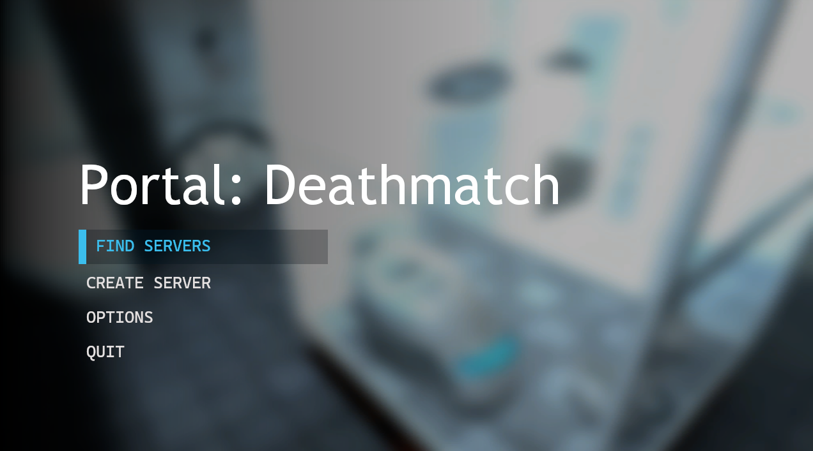
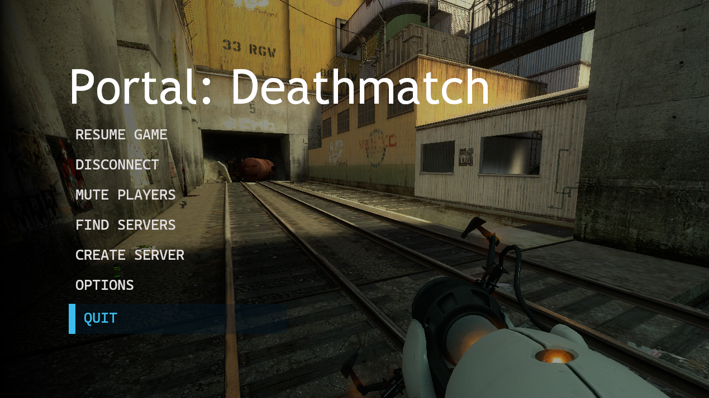
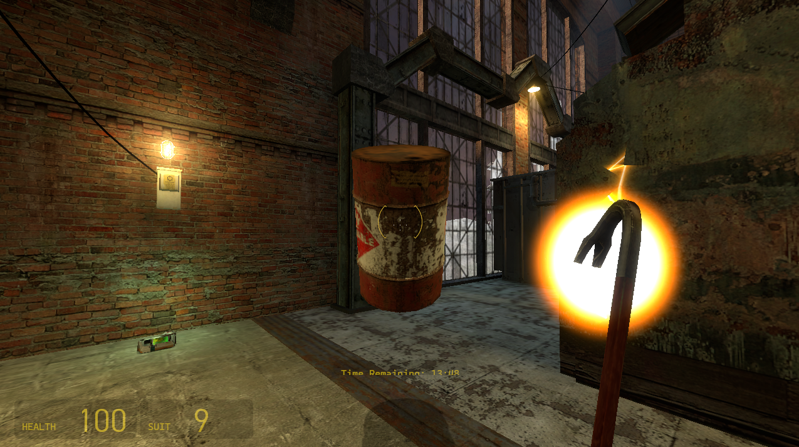
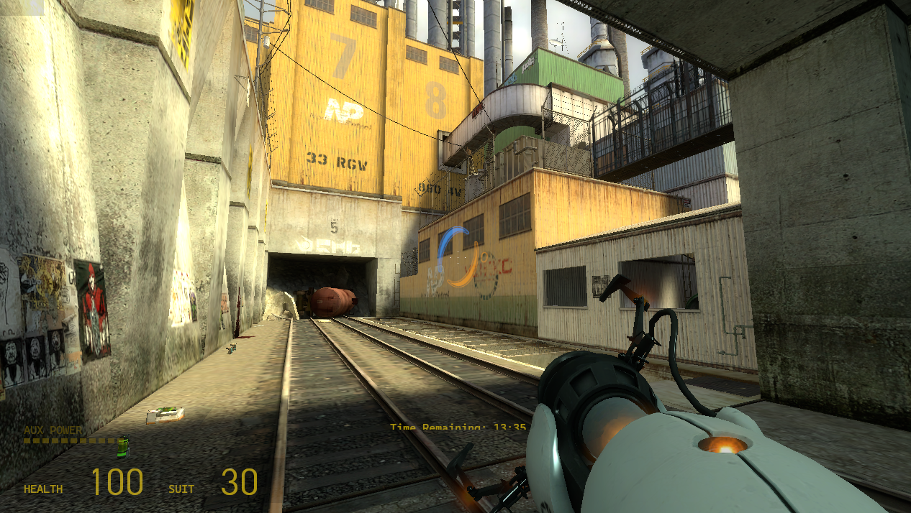

<br>
Deathmatch mode for Portal 1

## Features
- Online (lan)
- Chat and Voice chat
- Returned Server Browser
- Custom Menus
- Sourcemod/Metamod support

## Inforamtion and Guides
Find guides and info about Portal:DM in official [Wiki](https://github.com/DanilVusenko86/PortalDeathmatch/wiki/)

## Keys 
- C   - spray
- F   - flashlight
- T   - chat
- Tab - tablist (under dev)
- X   - voice chat

## New Menus
To trun on a new menus you need to add that in *Launch Options*

```LauchOptions
  -gamepadui
```
How its works ? Soo i just wrote some files which changes SteamDeckUI/GamePadUI to support some *Multiplayer* Features

> [!WARNING]
> Some standard *Source Engine* VGUI become bigger in Game Pad UI.

## Some Screenshots

| New Main Menu | New Pause Menu|
|:-----------------:|:-----------:|
|  |  |

| Funny Gravity Gun Bug | dm_underpass map |
|:-----------------:|:-----------:|
|  |  |

## Developers
DanilVusenko
